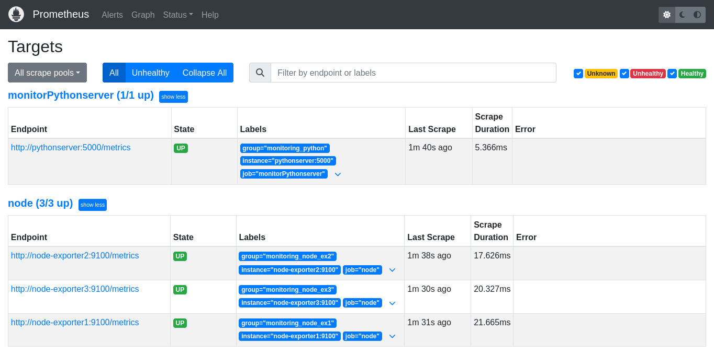
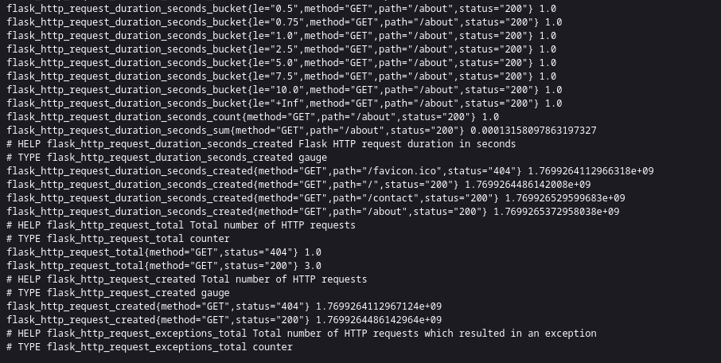
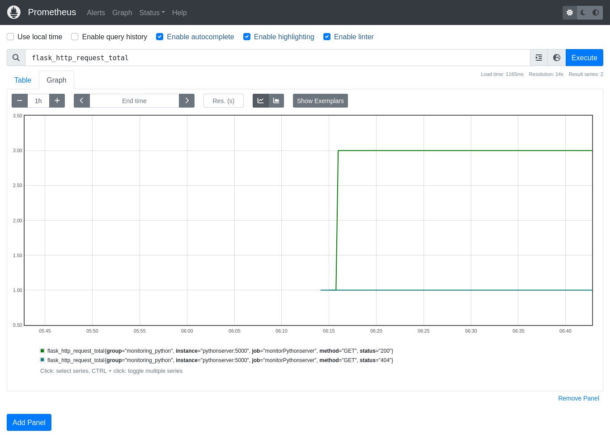

# Flask + Prometheus Monitoring Setup

This project demonstrates how to monitor a Flask application and system metrics using Prometheus and Node Exporter in Docker.

---

## Overview

- **Flask App**: A simple Flask server with three endpoints (`/`, `/about`, `/contact`).
- **Prometheus**: Collects and stores metrics from the Flask app and Node Exporters.
- **Node Exporters**: Simulate three servers, exposing system metrics to Prometheus.

<table align="center">
  <tr>
    <td align="center"></td>
    <td align="center"></td>
    <td align="center"></td>
  </tr>
  <tr>
    <td align="center"><small>Targets</small></td>
    <td align="center"><small>Raw Metrics</small></td>
    <td align="center"><small>Metrics shown in Prometheus</small></td>
  </tr>
</table>

---

## Prerequisites 

- Docker

---

## Setup & Run

1. **Clone the repository**:
   ```sh
   git clone https://github.com/ArthurPro123/Monitoring-with-Prometheus
   cd Monitoring-with-Prometheus

2. **Run the setup script**:
./setup.sh

---

## Screenshots

The Screenshots directory contains visual references for the Prometheus monitoring setup.
